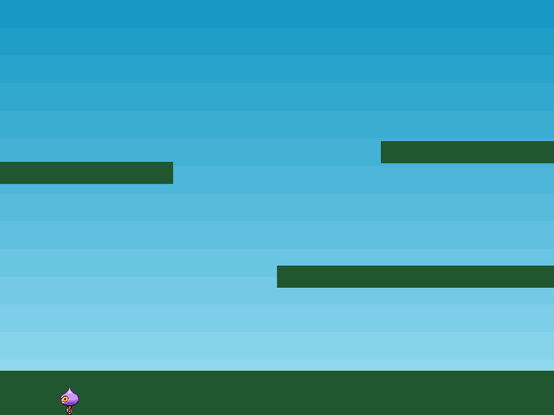
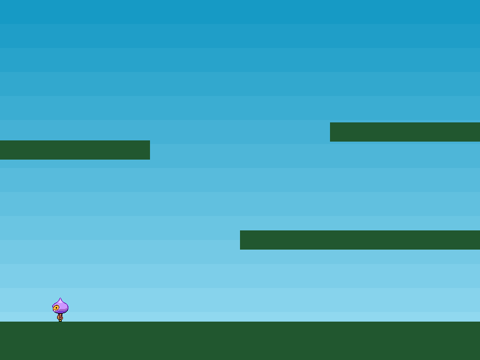

# Part 6: Body Velocity - A world of physics
Phaser has support for a variety of different physics systems, each acting as a plugin available to any Phaser Scene. 

At the time of writing it ships with Arcade Physics, Impact Physics and Matter.js Physics. 

For the sake of this tutorial we will be using the Arcade Physics system for our game, which is simple and light-weight, perfect for mobile browsers.

<br>

When a Physics Sprite is created it is given a `body` property, which is a reference to its Arcade Physics Body. This represents the sprite as a physical body in Phaser's Arcade Physics engine. The body object has a lot of properties and methods that we can play with.

For example:
- We can simulate the effects of gravity on a sprite
- `player.body.setGravityY(300)`
    - This is an arbitrary value, but logically, the higher the value, the heavier your object feels and the quicker it falls. 
    - If you run part 5, you'll see the player fall through the ground without stopping.



This is because we're not testing for collison between the ground and the player.

So...

- We told Phaser that our ground platform is static.
    - If we had made it dynamic, the player would have feel onto the ground and then the velocity would cause the ground to ALSO fall and everything would collapse.

In order to allow the player to collide with the static platform we can create a Collider object. This object monitors two physics objects (which can include Groups) and checks for collisions or overlap between them.
```js
this.physics.add.collider(player, platforms);
```

 It takes two objects and tests for collision and performs separation against them. In this case we're giving it the player sprite and the platforms Group. It's clever enough to run collision against all Group members, so this one call will collide against the ground and all platforms. The result is a firm platform that doesn't collapse:

 
 
## ➡️ Next steps:
Open up [part7.html](/part7.html) and [part7.md](part7.md) side by side to start coding


